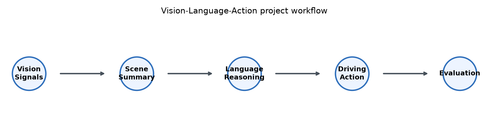
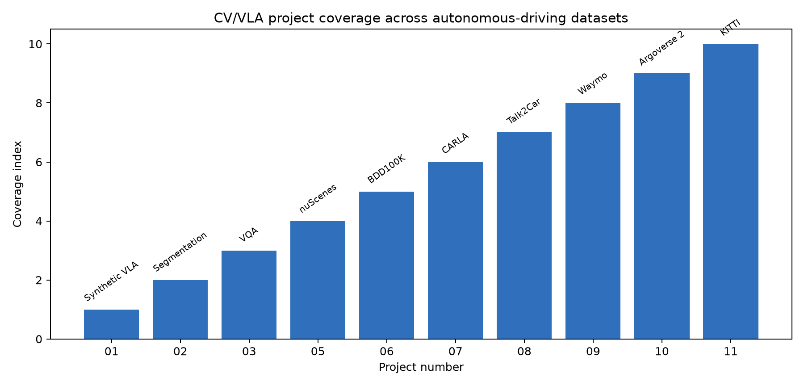
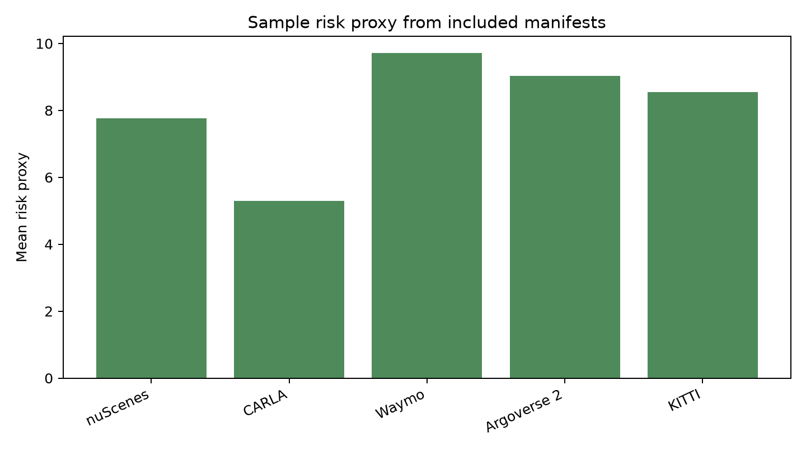

# Computer Vision for Vision-Language-Action Models

This portfolio was created to explore VLA models for autonomous driving PhD research.

It focuses on the research path from visual perception to language-grounded reasoning and high-level driving actions. Each project includes a README, sample data, and a runnable notebook. The real-dataset notebooks include dataset health checks, feature auditing, risk scoring, decision traces, evaluation summaries, visual review charts, export steps, and real-dataset upgrade plans.

## Research Goal

The goal is to build a portfolio around multimodal autonomous-driving intelligence:

- perceive driving scenes from camera, LiDAR, stereo, segmentation, and map-style signals
- convert perception into structured language descriptions
- select interpretable high-level driving actions
- prepare each baseline for later upgrade with real datasets and VLM/VLA models

## Visual Outputs

These figures summarize the current project structure and sample outputs.

See [RESULTS.md](RESULTS.md) for the baseline results summary and next evaluation targets.

See [ROADMAP.md](ROADMAP.md) for the research upgrade plan.

See [CHANGELOG.md](CHANGELOG.md) for the update history.

See [docs/research-notes.md](docs/research-notes.md) for research motivation, current limitations, and near-term direction.

## Projects

| # | Project | Dataset / Style | Focus |
|---|---|---|---|
| 01 | [Language-Guided Scene to Action](01-language-guided-scene-to-action/README.md) | Synthetic VLA scenes | Visual cues plus instruction to driving action |
| 02 | [Drivable-Area Segmentation to Action](02-drivable-area-segmentation-to-action/README.md) | Segmentation style | Drivable-area signals to action policy |
| 03 | [Traffic Scene VQA and Action Policy](03-traffic-scene-vqa-action-policy/README.md) | VQA style | Traffic-scene question answering and action selection |
| 04 | [VLA Autonomous Driving Research Roadmap](04-vla-autonomous-driving-research-roadmap/README.md) | Research roadmap | Datasets, papers, and expansion plan |
| 05 | [nuScenes VLA Scene Caption to Action](05-nuscenes-vla-scene-caption-action/README.md) | nuScenes | Multimodal scene captions and action decisions |
| 06 | [BDD100K Multi-Task Driving VLA](06-bdd100k-multitask-driving-vla/README.md) | BDD100K | Attributes, labels, and VLA decisions |
| 07 | [CARLA Closed-Loop VLA Agent](07-carla-closed-loop-vla-agent/README.md) | CARLA | Closed-loop simulator traces |
| 08 | [Talk2Car Command Grounding](08-talk2car-command-grounding/README.md) | Talk2Car | Natural-language command grounding |
| 09 | [Waymo Open Dataset Camera-LiDAR VLA](09-waymo-camera-lidar-vla/README.md) | Waymo Open Dataset | Camera and LiDAR perception signals |
| 10 | [Argoverse 2 HD Map Forecasting VLA](10-argoverse2-hdmap-forecasting-vla/README.md) | Argoverse 2 | HD-map and actor-forecast reasoning |
| 11 | [KITTI Stereo 3D Driving Perception](11-kitti-stereo-3d-driving-perception/README.md) | KITTI | Stereo, depth, and 3D perception cues |

## Dataset Setup

Small sample manifests are included so the notebooks run quickly. Full datasets should be downloaded from official sources and kept outside Git. See [DATASETS.md](DATASETS.md).
